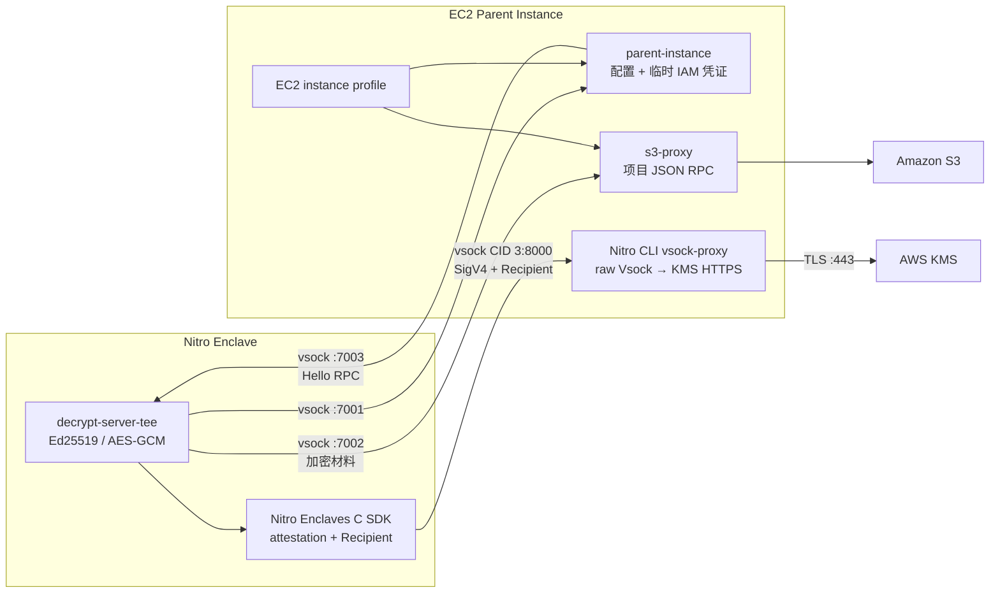

# AWS KMS Nitro Enclave Demo

这个项目演示在 AWS Nitro Enclave 中生成/恢复 Ed25519 密钥，并使用 AWS KMS data key 对私钥做信封加密。

生产模式下，KMS 调用由 enclave 内的 `decrypt-server-tee` 发起，通过 Nitro CLI 自带的 `vsock-proxy` 转发到 AWS KMS。项目使用官方 [`aws-nitro-enclaves-sdk-c`](https://github.com/aws/aws-nitro-enclaves-sdk-c) 生成 attestation document、设置 KMS `Recipient` 并在 enclave 内解开 `CiphertextForRecipient`。parent instance 不会接触 plaintext data key。

S3 仍由 parent instance 访问；enclave 与项目自带的 `s3-proxy` 只交换加密后的 key material。

## 架构



项目中有三个二进制：

- `decrypt-server-tee`：运行在 enclave，生成/恢复 Ed25519 私钥并直接执行 attested KMS 操作。
- `parent-instance`：提供业务配置，并从 EC2 instance profile 刷新临时 AWS 凭证后传给 enclave。
- `s3-proxy`：在 parent 上调用 S3，只允许访问配置的单个 `s3://bucket/key`。

`decrypt-server-tee` 完成密钥生成/恢复后还会启动一个简单 RPC 服务。`parent-instance hello` 可以通过 TCP（本地）或 Vsock（真实 enclave）调用它，并获得 `hello from enclave`。

此外，parent 上需要运行 Nitro CLI 安装的官方 `vsock-proxy`。它不是本项目的二进制。

## 密钥流程

首次运行：

1. `decrypt-server-tee` 从 `parent-instance` 获取 KMS key ID、S3位置等配置。
2. `decrypt-server-tee` 请求 `s3-proxy` 读取 key material；对象不存在时进入生成模式。
3. `decrypt-server-tee` 获取短期 IAM 凭证，调用官方 C SDK 的 `aws_kms_generate_data_key_blocking`。
4. C SDK 在 enclave 内生成临时 RSA 密钥和 attestation document，经 `vsock-proxy` 调用 KMS `GenerateDataKey`。
5. KMS 校验 attestation/PCR，返回 `CiphertextBlob` 和 `CiphertextForRecipient`；C SDK只在 enclave 内恢复 plaintext data key。
6. `decrypt-server-tee` 生成 Ed25519 密钥，用 AES-GCM 加密私钥，并通过 `s3-proxy` 把密文材料写入 S3。

恢复运行：

1. `s3-proxy` 从 S3 返回加密的私钥、encrypted data key、nonce、公钥和自检签名。
2. C SDK 使用新的 attestation document 调用 KMS `Decrypt`。
3. plaintext data key 只在 enclave 内恢复，用完后由 Rust `Zeroizing` 和 C shim 清理。
4. 程序解密 Ed25519 私钥，并校验派生公钥和固定 challenge 签名。

## 本地开发

本地模式不需要 Nitro C SDK，`decrypt-server-tee` 直接使用 Rust AWS SDK 调 KMS。这个模式仅用于开发，plaintext data key 会存在于本地进程中。

准备配置：

```bash
cp .env.example .env
# 编辑 AWS_REGION、KMS_KEY_ID、S3_BUCKET；凭证也可来自本机 AWS profile
```

终端 1：

```bash
cargo run --bin parent-instance
```

终端 2：

```bash
cargo run --bin s3-proxy
```

终端 3：

```bash
RUNNING_IN_ENCLAVE=false cargo run --bin decrypt-server-tee
```

终端 4，调用 enclave Hello RPC：

```bash
cargo run --bin parent-instance -- hello
# 输出：hello from enclave
```

本地 Hello RPC 默认使用 `tcp:127.0.0.1:7003`。

运行测试：

```bash
cargo test --all-targets
```

## 构建 Nitro enclave 版本

Nitro feature 仅支持 Linux。先按照官方仓库构建并安装 `aws-nitro-enclaves-sdk-c` 及其依赖，然后指定安装位置：

```bash
export NITRO_SDK_PREFIX=/usr/local

cargo build \
  --release \
  --bin decrypt-server-tee \
  --features nitro-enclave
```

构建脚本默认查找：

- headers：`$NITRO_SDK_PREFIX/include`
- libraries：`$NITRO_SDK_PREFIX/lib`

可以分别用下面的变量覆盖：

```bash
NITRO_SDK_INCLUDE=/custom/include
NITRO_SDK_LIB_DIR=/custom/lib
```

默认链接这些库：

```text
aws-nitro-enclaves-sdk-c,aws-c-auth,aws-c-io,aws-c-http,aws-c-common
```

如果安装方式还需要显式链接其他静态依赖，可以覆盖：

```bash
export NITRO_SDK_LIBS=aws-nitro-enclaves-sdk-c,aws-c-auth,aws-c-io,aws-c-http,aws-c-common,nsm,json-c
```

将编译出的 `decrypt-server-tee`、Nitro SDK 动态库（如果使用动态链接）以及所需 CA证书一起放入 enclave Docker image，再使用：

```bash
nitro-cli build-enclave \
  --docker-uri aws-kms-demo-enclave:latest \
  --output-file aws-kms-demo.eif
```

记录输出的 PCR0；生产 KMS policy 需要使用这个值。EIF 内运行时设置：

```text
RUNNING_IN_ENCLAVE=true
PARENT_CONFIG_ENDPOINT=vsock:3:7001
S3_PROXY_ENDPOINT=vsock:3:7002
NITRO_PARENT_CID=3
NITRO_KMS_PROXY_PORT=8000
ENCLAVE_RPC_LISTEN_ENDPOINT=vsock:0:7003
```

## Parent instance 部署

启动配置/临时凭证服务：

```bash
PARENT_CONFIG_ENDPOINT=vsock:0:7001 \
PARENT_ALLOWED_ENCLAVE_CID=16 \
cargo run --release --bin parent-instance
```

启动 S3 RPC：

```bash
S3_PROXY_ENDPOINT=vsock:0:7002 \
cargo run --release --bin s3-proxy
```

启动 Nitro CLI 官方 KMS proxy：

```bash
AWS_REGION=ap-southeast-1
sudo vsock-proxy 8000 kms.$AWS_REGION.amazonaws.com 443
```

如果使用 `nitro-enclaves-vsock-proxy.service`，确认 `/etc/nitro_enclaves/vsock-proxy.yaml` 的 allowlist 包含对应区域的 KMS endpoint，并确认服务监听 port 8000。

最后启动 enclave（CID 可自行指定；这里使用 16）：

```bash
nitro-cli run-enclave \
  --eif-path aws-kms-demo.eif \
  --memory 1024 \
  --cpu-count 2 \
  --enclave-cid 16
```

enclave 连接 parent 时 CID 始终为 `3`，不是上面设置的 enclave CID `16`。

从 parent 调用 enclave Hello RPC（目标 CID 必须与 `--enclave-cid` 一致）：

```bash
ENCLAVE_RPC_ENDPOINT=vsock:16:7003 \
cargo run --release --bin parent-instance -- hello
# 输出：hello from enclave
```

## KMS key policy

IAM role 需要 `kms:GenerateDataKey` 和 `kms:Decrypt`，KMS key policy 还必须用 attestation condition 限制 EIF，例如：

```json
{
  "Effect": "Allow",
  "Principal": {
    "AWS": "arn:aws:iam::123456789012:role/nitro-enclave-parent-role"
  },
  "Action": [
    "kms:GenerateDataKey",
    "kms:Decrypt"
  ],
  "Resource": "*",
  "Condition": {
    "StringEqualsIgnoreCase": {
      "kms:RecipientAttestation:ImageSha384": "<EIF-PCR0>"
    }
  }
}
```

生产环境不要使用 `--debug-mode`。debug enclave 的 PCR 全零，不能提供有效的镜像身份约束。EIF 内容发生变化后 PCR0 也会变化，发布时需要同步更新 KMS policy。

S3 IAM 权限只需要：

- `s3:GetObject`
- `s3:PutObject`

应把资源限制到配置的 `S3_BUCKET/S3_KEY`。项目的 `s3-proxy` 也会在应用层拒绝其他 bucket/key。

## 配置

Parent 业务配置：

- `AWS_REGION` 或 `AWS_DEFAULT_REGION`
- `KMS_KEY_ID`
- `S3_BUCKET`
- `S3_KEY`，默认 `kms-keypair.json`
- `KMS_KEY_SPEC`：`AES_128` 或 `AES_256`，默认 `AES_256`
- `KMS_NUMBER_OF_BYTES`：`16` 或 `32`，不能和 `KMS_KEY_SPEC` 同时设置
- `KMS_ENCRYPTION_CONTEXT`
- `KMS_GRANT_TOKENS`
- `KMS_DRY_RUN`

Endpoint/KMS模式：

- `PARENT_CONFIG_ENDPOINT`，本地默认 `tcp:127.0.0.1:7001`
- `PARENT_ALLOWED_ENCLAVE_CID`，parent 在 Vsock 模式下只向该 enclave CID 返回临时凭证
- `S3_PROXY_ENDPOINT`，本地默认 `tcp:127.0.0.1:7002`
- `ENCLAVE_RPC_LISTEN_ENDPOINT`：`decrypt-server-tee` 的 RPC 监听地址；本地默认 `tcp:127.0.0.1:7003`，EIF 中为 `vsock:0:7003`
- `ENCLAVE_RPC_ENDPOINT`：`parent-instance hello` 的目标地址；本地默认 `tcp:127.0.0.1:7003`，真实 enclave 示例为 `vsock:16:7003`
- `RUNNING_IN_ENCLAVE`：默认 `false`；`false` 直接调用 KMS，`true` 使用 attestation 和官方 KMS proxy
- `NITRO_PARENT_CID`，默认 `3`
- `NITRO_KMS_PROXY_PORT`，默认 `8000`

AWS 凭证优先使用 EC2 instance profile 的短期凭证。`parent-instance` 每次收到凭证请求都会通过 AWS SDK credential provider 刷新凭证；不要在生产 `.env` 中保存长期 access key。

### Nitro C SDK 高层 API限制

当 `RUNNING_IN_ENCLAVE=true` 时，当前 FFI 使用官方高层 data-key API：

- 支持 AES-128/AES-256；
- `Decrypt` 支持 encryption context；
- `GenerateDataKey` 高层函数不接受 encryption context，因此 Nitro 生成模式会拒绝 `KMS_ENCRYPTION_CONTEXT`；
- Nitro 模式暂不支持 `KMS_GRANT_TOKENS` 和 `KMS_DRY_RUN`。

如果需要这些参数，应继续扩展 C shim，使用 SDK 的底层 request structures，而不能退回到 parent 解密 data key。

## 安全边界

- 官方 KMS proxy 只转发 TLS 流量；真正的保护来自 KMS `Recipient` 和 attestation-based key policy。
- parent 知道临时 IAM 凭证，但 KMS policy 要求有效的 enclave PCR，parent 无法单独获得 plaintext data key。
- parent 部署时应设置 `PARENT_ALLOWED_ENCLAVE_CID`，避免同一 parent 上的其他 enclave 请求临时凭证。
- parent 可以删除、替换或回滚 S3 对象，因此自检签名只证明对象内部一致性。生产系统还应把预期公钥/版本锚定到 parent 之外的可信存储，并实现防回滚。
- JSON RPC frame 上限为 1 MiB，`s3-proxy` 只允许配置的单个对象。
- IAM role 和 KMS key policy 都应使用最小权限。
