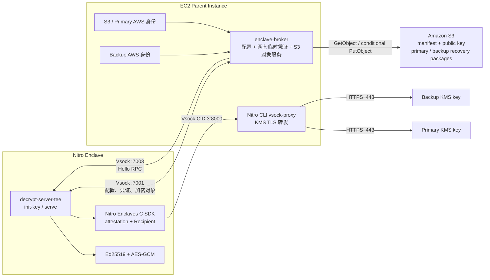

# AWS KMS Nitro Enclave Demo

本项目在 AWS Nitro Enclave 内生成和恢复 Ed25519 私钥。私钥只允许通过显式的 `init-key` 操作生成；正常启动只读取既有资源，S3 资源不存在时直接退出，不会生成替代私钥。

完整的本地与 Nitro Enclave 操作命令见 [启动运行手册](docs/STARTUP.md)。

## 安全模型

同一把 Ed25519 私钥分别使用 primary、backup 两把 KMS key 生成的 data key 独立加密，恢复策略为 `any-one`。推荐两把 key 来自不同 AWS 账号；同账号也允许，但会失去账号级隔离能力：

- primary KMS 成功时立即使用 primary 恢复；
- primary 的凭证、S3 恢复包、KMS 或 AES-GCM 解密失败时继续尝试 backup；
- 任意一套成功即可启动服务；
- 两套都失败时进程退出，gRPC 不会启动。

初始化需要两套 KMS 都成功，并会分别做一次完整恢复校验。正常运行身份不应拥有 `kms:GenerateDataKey` 或 `s3:PutObject` 权限。

## 架构



初始化时，App 必须分别通过 primary 和 backup 生成并验证两套恢复包，最后提交 manifest。正常启动时按 primary、backup 顺序尝试，任意一个成功即可恢复同一把私钥并启动服务。

## S3 资源布局

假设 `S3_PREFIX=kms-keypair`：

```text
kms-keypair/
├── key_manifest.json
├── public_key_sha256-<public-key-fingerprint>.json
├── kms-key-<primary-key-id-last8>-<kms-arn-hash12>/
│   └── encrypted_private_key_by_kms-key-<primary-key-id-last8>_sha256-<content-hash>.json
└── kms-key-<backup-key-id-last8>-<kms-arn-hash12>/
    └── encrypted_private_key_by_kms-key-<backup-key-id-last8>_sha256-<content-hash>.json
```

每个恢复包只包含：

```json
{
  "version": 2,
  "encrypted_data_key_base64": "...",
  "private_key_nonce_base64": "...",
  "encrypted_private_key_base64": "..."
}
```

目录名由完整 KMS Key ARN 的 SHA-256 前 12 位参与生成，因此即使不同账号的 key ID 相同也不会冲突；完整 ARN 保存在 `key_manifest.json` 中，不直接放入 S3 文件名。

公钥文件包含 Ed25519 公钥和公钥 SHA-256 fingerprint。恢复私钥后，程序重新派生公钥并比较 fingerprint，不再保存额外的 self-check challenge/signature。

叶子对象使用内容 hash 命名。`key_manifest.json` 是固定入口并在最后写入，相当于整组资源的提交标志。所有写入都使用 S3 `If-None-Match: *`，已有对象不会被覆盖。

旧版单文件 `kms-keypair.json` 不会被自动读取、删除或迁移。若其中已经保存生产私钥，应保留原对象，并单独设计“解密旧私钥后重新封装为 v2”的迁移流程，不能执行新的 `init-key` 代替它。

## 最少配置

```dotenv
AWS_REGION=ap-southeast-1
S3_BUCKET=your-bucket
S3_PREFIX=kms-keypair

KMS_PRIMARY_KEY_ARN=arn:aws:kms:ap-southeast-1:111122223333:key/...
KMS_BACKUP_KEY_ARN=arn:aws:kms:ap-southeast-1:444455556666:key/...

KMS_BACKUP_ACCESS_KEY_ID=...
KMS_BACKUP_SECRET_ACCESS_KEY=...
```

必须使用完整 KMS key ARN。Region 和账号 ID 从 ARN 解析，不需要重复配置。当前两个 KMS key 必须位于同一 Region，以共用一个 enclave KMS vsock-proxy。推荐使用不同 AWS 账号；同账号也允许运行，但程序会输出醒目的安全警告，且不具备账号级隔离能力。

primary 默认使用 AWS SDK 默认凭证链，也可以通过 `KMS_PRIMARY_ACCESS_KEY_ID` 和 `KMS_PRIMARY_SECRET_ACCESS_KEY` 显式指定。backup 使用 `KMS_BACKUP_*`。生产环境建议使用短期凭证；凭证只存在于 Parent broker，不进入 EIF 或 S3。

## 本地运行

```bash
cp .env.example .env
# 编辑两把 KMS key ARN、两套凭证和 S3 配置
```

### 首次部署：只执行一次 Init Key

终端 1 必须以 `init-key` 模式启动 broker：

```bash
DECRYPT_SERVER_TEE_MODE=init-key \
cargo run --bin enclave-broker
```

终端 2 执行一次初始化：

```bash
RUNNING_IN_ENCLAVE=false cargo run --bin decrypt-server-tee -- init-key
```

初始化成功写入 `key_manifest.json` 后，停止终端 1 的 broker。不要再次执行本节命令。

### 后续运行：正常启动

终端 1 以 `serve` 模式启动 broker：

```bash
DECRYPT_SERVER_TEE_MODE=serve \
cargo run --bin enclave-broker
```

然后启动 `decrypt-server-tee`：

```bash
RUNNING_IN_ENCLAVE=false cargo run --bin decrypt-server-tee -- serve
```

如果 `key_manifest.json` 不存在，正常启动会报错退出。

## Nitro Enclave 初始化

EIF 的入口固定为 `/app/decrypt-server-tee`，而 `nitro-cli run-enclave` 不能临时追加 `init-key` 参数。因此初始化模式由本次 Parent broker 下发。项目提供脚本完成这个过程：

```bash
./scripts/init-key-in-enclave.sh
```

运行前需要：

- 已构建 `target/release/enclave-broker` 和 EIF；
- KMS vsock-proxy 已监听端口 `8000`；
- Parent 环境中已配置 S3、两把 KMS key ARN 和两套 KMS 凭证；
- 目标 S3 prefix 尚无 `key_manifest.json`。

脚本启动一个仅用于本次操作的 `DECRYPT_SERVER_TEE_MODE=init-key` broker，再启动 enclave。初始化完成后 enclave 退出，脚本停止临时 broker。之后应以普通 `serve` 模式重新启动 broker 和 enclave。

## 二进制和通信

- `decrypt-server-tee`：运行在 enclave，执行 Ed25519、AES-GCM 和 attested KMS 操作。
- `enclave-broker`：运行在 Parent，提供运行配置、按 primary/backup 选择的短期凭证，以及受限的 S3 对象读写。
- Nitro CLI `vsock-proxy`：把 enclave 内的 KMS TLS 流量转发到同 Region KMS endpoint。

默认端口：

| 端口 | 用途 |
| ---: | --- |
| 7001 | Enclave → Parent broker |
| 7003 | Parent → Enclave gRPC |
| 8000 | Enclave → KMS vsock-proxy |

## 权限建议

正常运行：

- S3 身份：`s3:GetObject`；
- primary/backup KMS 身份：各自只有对应 key 的 `kms:Decrypt`。

一次性初始化：

- S3 身份：`s3:GetObject`、`s3:PutObject`；
- 两个 KMS 身份：对应 key 的 `kms:GenerateDataKey`、`kms:Decrypt`。

初始化完成后撤销写入和生成权限。S3 还应启用 Versioning、删除保护或 Object Lock；双 KMS 只能保证两条解密路径，不能恢复被彻底删除的 S3 密文。

## 构建和测试

```bash
cargo test --all-targets
```

Nitro feature 只支持 Linux：

```bash
NITRO_SDK_PREFIX=/usr/local \
./scripts/build-eif.sh
```

EIF 内容变化会改变 PCR0。发布新 EIF 后必须同步更新两个账号中的 KMS key policy，并保持 attestation 条件一致。生产环境不要使用 debug enclave。
